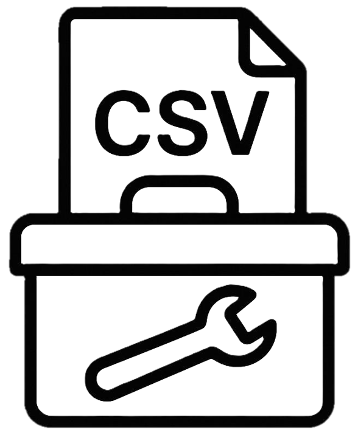

# CSVToolBox

<p align="center">
  
</p>

🇺🇸 **English** | [🇧🇷 Português](#português)

A toolkit for processing CSV, Excel and other tabular formats. Built to automate repetitive data manipulation tasks.


[](https://github.com/GuilhermeP96/CSVToolBox)

## About

CSVToolBox was born from the need to consolidate various Python scripts I used daily to process CSV files. Instead of searching for which script to use for each task, I created this unified interface with the most common tools.

Works with both graphical interface (GUI) and command line (CLI). **Automatically detects system language** (English/Portuguese).

## Download

### Standalone Executable (Recommended)
Download the latest `CSVToolBox.exe` from the [Releases](https://github.com/GuilhermeP96/CSVToolBox/releases) page.
- No Python installation required
- All dependencies included
- Just download and run!

### From Source

```bash
git clone https://github.com/GuilhermeP96/CSVToolBox.git
cd CSVToolBox
pip install -r requirements.txt
```

## Usage

### Graphical Interface

**Executable:**
```bash
CSVToolBox.exe
```

**From source:**
```bash
python main.py
```

### Command Line

**Executable:**
```bash
# Show help
CSVToolBox.exe --help

# Merge multiple CSVs
CSVToolBox.exe merge file1.csv file2.csv -o merged.csv

# Split large file
CSVToolBox.exe split large_file.csv -l 50000

# Clean data
CSVToolBox.exe clean data.csv --remove-duplicates --remove-empty

# Convert Excel to CSV
CSVToolBox.exe excel spreadsheet.xlsx -o data.csv

# Convert XML to CSV
CSVToolBox.exe xml data.xml -o output.csv
```

**From source:**
```bash
python cli.py --help
```

## Available Tools

| Tool | Description |
|------|-------------|
| **� Merge CSVs** | Combine multiple CSV files into one |
| **✂️ Split CSV** | Break large files into smaller parts |
| **🧹 Clean CSV** | Remove special characters, quotes and clean data |
| **🔄 Convert Format** | Convert between CSV, XLSX, JSON formats |
| **⚙️ Transform Data** | Replace values using lookup tables |
| **📄 XML to CSV** | Extract data from XML to tabular format |
| **📊 Excel to CSV** | Convert spreadsheets with header normalization |
| **📊 Excel Multi-Profiles** | Advanced Excel conversion with configurable profiles |
| **🔧 Clean Columns** | Remove accents and normalize column text |
| **📝 TXT to CSV** | Convert delimited or fixed-width TXT files |
| **📊 Verticalize Data** | Unpivot data and apply sanitization |
| **🔀 Workflow Orchestrator** | Create and run automated process sequences |

## New in v1.1: Workflow Orchestrator

Create automated workflows by chaining multiple tools:

1. Configure any tool with your parameters
2. Click **"➕ Add to Workflow"** button
3. Repeat for each step you need
4. Go to Workflow Orchestrator and click **"▶️ Run All"**

**Features:**
- Visual queue with step status
- Reorder/remove steps
- Save/load workflow presets
- Chain outputs: each step can use previous step's output

## Features

- 🌐 **Bilingual**: Automatic English/Portuguese based on system language
- 📋 **Profiles**: Save configurations for recurring processes
- 🕐 **History**: Track recent processes for quick access
- 🖥️ **Dual Interface**: GUI and CLI support
- 📁 **Multiple Formats**: CSV, XLSX, XLS, XLSB, XML, JSON, TXT
- 🔍 **Auto-detection**: Encoding and separator detection
- 🔀 **Workflow Automation**: Chain multiple tools into automated sequences

## Configuration

Settings and profiles are saved in:
- **Windows**: `Documents\CSVToolBox\`
- **Linux/Mac**: `~/Documents/CSVToolBox/`

Workflows are saved in: `Documents\CSVToolBox\workflows\`

## Structure

```
CSVToolBox/
├── main.py              # GUI application
├── cli.py               # Command line interface
├── i18n.py              # Internationalization
├── requirements.txt
└── tools/
    ├── csv_merger.py
    ├── csv_splitter.py
    ├── csv_cleaner.py
    ├── csv_converter.py
    ├── csv_transformer.py
    ├── xml_parser.py
    ├── excel_to_csv.py
    ├── xlsx_to_csv_profiles.py
    ├── column_cleaner.py
    ├── txt_parser.py
    ├── data_verticalizer.py    # NEW
    ├── workflow_manager.py      # NEW
    ├── workflow_orchestrator.py # NEW
    └── profile_manager.py
```

## Dependencies

- customtkinter - Modern GUI
- pandas - Data manipulation
- openpyxl - Excel files (.xlsx)
- xlrd - Legacy Excel files (.xls)
- pyxlsb - Binary Excel files (.xlsb)
- chardet - Encoding detection

## License

MIT

---

# Português

🇧🇷 **Português** | [🇺🇸 English](#csvtoolbox)

Ferramenta para tratamento de arquivos CSV, Excel e outros formatos tabulares. Desenvolvida para automatizar tarefas repetitivas de manipulação de dados.

## Sobre

O CSVToolBox nasceu da necessidade de consolidar vários scripts Python que eu usava no dia a dia para processar arquivos CSV. Em vez de ficar procurando qual script usar para cada tarefa, criei essa interface unificada com as ferramentas mais comuns.

Funciona tanto com interface gráfica (GUI) quanto por linha de comando (CLI). **Detecta automaticamente o idioma do sistema** (Inglês/Português).

## Download

### Executável Standalone (Recomendado)
Baixe o `CSVToolBox.exe` mais recente na página de [Releases](https://github.com/GuilhermeP96/CSVToolBox/releases).
- Não precisa instalar Python
- Todas as dependências incluídas
- Basta baixar e executar!

### Código Fonte

```bash
git clone https://github.com/GuilhermeP96/CSVToolBox.git
cd CSVToolBox
pip install -r requirements.txt
```

## Uso

### Interface Gráfica

**Executável:**
```bash
CSVToolBox.exe
```

**Código fonte:**
```bash
python main.py
```

### Linha de Comando

**Executável:**
```bash
# Ver ajuda
CSVToolBox.exe --help

# Consolidar vários CSVs
CSVToolBox.exe merge arquivo1.csv arquivo2.csv -o consolidado.csv

# Dividir arquivo grande
CSVToolBox.exe split arquivo_grande.csv -l 50000

# Limpar dados
CSVToolBox.exe clean dados.csv --remove-duplicates --remove-empty

# Converter Excel para CSV
CSVToolBox.exe excel planilha.xlsx -o dados.csv

# Converter XML para CSV
CSVToolBox.exe xml dados.xml -o saida.csv
```

**Código fonte:**
```bash
python cli.py --help
```

## Ferramentas Disponíveis

| Ferramenta | Descrição |
|------------|-----------|
| **� Consolidar CSVs** | Junta múltiplos arquivos CSV em um só |
| **✂️ Dividir CSV** | Quebra arquivos grandes em partes menores |
| **🧹 Limpar CSV** | Remove caracteres especiais, aspas e limpa dados |
| **🔄 Converter Formato** | Converte entre CSV, XLSX, JSON |
| **⚙️ Transformar Dados** | Substitui valores usando tabela DE-PARA |
| **📄 XML para CSV** | Extrai dados de XML para formato tabular |
| **📊 Excel para CSV** | Converte planilhas com normalização de headers |
| **📊 Excel Multi-Perfis** | Conversão avançada de Excel com perfis configuráveis |
| **🔧 Limpar Colunas** | Remove acentos e normaliza texto de colunas |
| **📝 TXT para CSV** | Converte TXT delimitado ou largura fixa |
| **📊 Verticalizar Dados** | Despivota dados e aplica higienização |
| **🔀 Orquestrador de Workflow** | Cria e executa sequências de processos automatizados |

## Novidade v1.1: Orquestrador de Workflow

Crie fluxos de trabalho automatizados encadeando múltiplas ferramentas:

1. Configure qualquer ferramenta com seus parâmetros
2. Clique no botão **"➕ Adicionar ao Workflow"**
3. Repita para cada etapa que precisar
4. Vá ao Orquestrador de Workflow e clique **"▶️ Executar Todos"**

**Recursos:**
- Fila visual com status de cada etapa
- Reordenar/remover etapas
- Salvar/carregar presets de workflow
- Encadear saídas: cada etapa pode usar a saída da anterior

## Recursos

- 🌐 **Bilíngue**: Inglês/Português automático baseado no idioma do sistema
- 📋 **Perfis**: Salve configurações para processos recorrentes
- 🕐 **Histórico**: Acompanhe processos recentes para acesso rápido
- 🖥️ **Interface Dupla**: Suporte a GUI e CLI
- 📁 **Múltiplos Formatos**: CSV, XLSX, XLS, XLSB, XML, JSON, TXT
- 🔍 **Auto-detecção**: Detecta encoding e separador automaticamente
- 🔀 **Automação de Workflow**: Encadeie múltiplas ferramentas em sequências automatizadas

## Configuração

As configurações e perfis são salvos em:
- **Windows**: `Documentos\CSVToolBox\`
- **Linux/Mac**: `~/Documents/CSVToolBox/`

Workflows são salvos em: `Documentos\CSVToolBox\workflows\`

## Estrutura

```
CSVToolBox/
├── main.py              # Aplicação GUI
├── cli.py               # Interface de linha de comando
├── i18n.py              # Internacionalização
├── requirements.txt
└── tools/
    ├── csv_merger.py
    ├── csv_splitter.py
    ├── csv_cleaner.py
    ├── csv_converter.py
    ├── csv_transformer.py
    ├── xml_parser.py
    ├── excel_to_csv.py
    ├── xlsx_to_csv_profiles.py
    ├── column_cleaner.py
    ├── txt_parser.py
    ├── data_verticalizer.py    # NOVO
    ├── workflow_manager.py      # NOVO
    ├── workflow_orchestrator.py # NOVO
    └── profile_manager.py
```

## Dependências

- customtkinter - GUI moderna
- pandas - Manipulação de dados
- openpyxl - Arquivos Excel (.xlsx)
- xlrd - Arquivos Excel legados (.xls)
- pyxlsb - Arquivos Excel binários (.xlsb)
- chardet - Detecção de encoding

## Licença

MIT - © 2025 Guilherme Pinheiro

---

**Autor / Author**: Guilherme Pinheiro  
**GitHub**: https://github.com/GuilhermeP96/CSVToolBox
